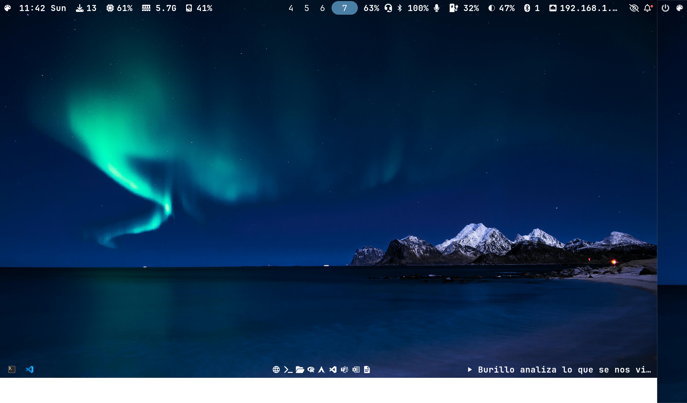
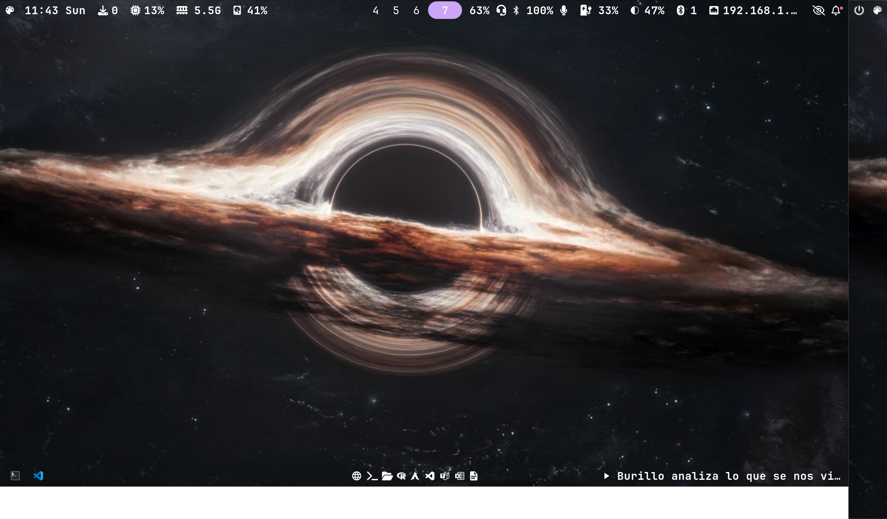
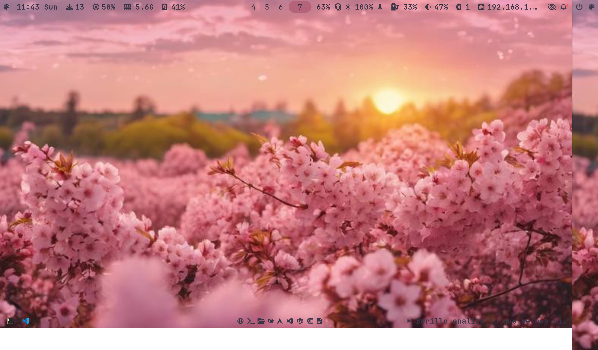
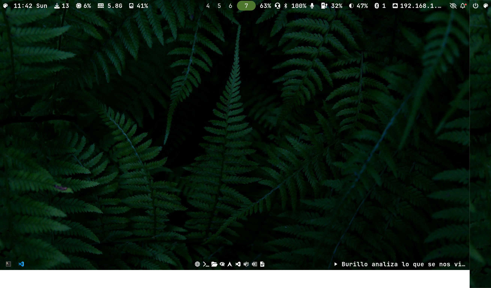

<div align="center">

# 🌲 dotfiles

**Sway · Waybar · Rofi · Foot · SwayNC · Starship**

*A modular, theme-switchable Wayland rice for Arch Linux*

[](https://archlinux.org)
[](https://swaywm.org)
[](LICENSE)

</div>

---

## Screenshots

> Drop your screenshots in `Themes/screenshots/` and they will appear here.

| Evergreen Forest | Artic Night |
|:---:|:---:|s
|  |  |

| Rosé Pine | Rosé Pine Dawn |
|:---:|:---:|
|  |  |

| Catppuccin Mocha | Catppuccin Latte |
|:---:|:---:|
|  |  |

---

## Features

- **6 themes** — dark, light, and everything in between
- **Single source of truth** — edit one `.conf` file to change every color everywhere
- **Instant switching** — one keybind or waybar click switches theme, reloads sway, swaync, and waybar automatically
- **Wallpaper auto-detection** — drop `<theme-slug>.jpg` in `Themes/wallpapers/` and it gets picked up
- **Fully modular sway config** — split across numbered `config.d/` files
- **Swaylock themed** — lock screen colors match the active theme

---

## Theme Gallery

| Slug | Name | Style |
|---|---|---|
| `evergreen` | Evergreen Forest | Dark · Green |
| `artic-night` | Artic Night | Dark · Blue |
| `rose-pine` | Rosé Pine | Dark · Rose/Mauve |
| `rose-pine-dawn` | Rosé Pine Dawn | Light · Rose/Cream |
| `catppuccin-mocha` | Catppuccin Mocha | Dark · Lavender |
| `catppuccin-latte` | Catppuccin Latte | Light · Lavender |

---

## Stack

| Component | App |
|---|---|
| Compositor | [Sway](https://swaywm.org) |
| Bar | [Waybar](https://github.com/Alexays/Waybar) |
| Launcher / Menus | [Rofi](https://github.com/davatorium/rofi) |
| Terminal | [Foot](https://codeberg.org/dnkl/foot) |
| Notifications | [SwayNC](https://github.com/ErikReider/SwayNotificationCenter) |
| Shell prompt | [Starship](https://starship.rs) |
| Lock screen | [Swaylock](https://github.com/mortie/swaylock) |
| Fetch | [Fastfetch](https://github.com/fastfetch-cli/fastfetch) |
| Wallpaper | [Swaybg](https://github.com/swaywm/swaybg) |
| Monitor layout | [Kanshi](https://git.sr.ht/~emersion/kanshi) |

---

## Structure

```
dotfiles/
├── Themes/
│   ├── evergreen.conf          # master color sources
│   ├── artic-night.conf
│   ├── rose-pine.conf
│   ├── rose-pine-dawn.conf
│   ├── catppuccin-mocha.conf
│   ├── catppuccin-latte.conf
│   ├── generate.sh             # theme generator
│   ├── switch-theme.sh         # theme switcher (rofi picker)
│   ├── scripts/                # per-app generator modules
│   │   ├── waybar.sh
│   │   ├── rofi.sh
│   │   ├── sway.sh
│   │   ├── swaync.sh
│   │   ├── swaylock.sh
│   │   ├── starship.sh
│   │   ├── foot.sh
│   │   └── fastfetch.sh
│   ├── swaync/
│   │   └── config.json         # static swaync layout
│   ├── wallpapers/             # one image per theme slug
│   └── screenshots/            # one screenshot per theme
└── .config/
    ├── sway/
    │   ├── config              # main sway config (includes config.d/*)
    │   ├── config.d/           # modular sway config
    │   │   ├── 00-environment.conf
    │   │   ├── 01-variables.conf
    │   │   ├── 02-input.conf
    │   │   ├── 03-binds.conf
    │   │   ├── 04-mouse.conf
    │   │   ├── 05-appearance.conf
    │   │   ├── 06-workspaces_vars.conf
    │   │   ├── 07-startup.conf
    │   │   └── 08-wallpaper.conf
    │   └── scripts/            # sway helper scripts
    │       ├── execwaybar.sh
    │       ├── powermenu.sh
    │       ├── theater.sh
    │       └── bluetooth.sh
    ├── waybar/
    │   ├── config              # top bar
    │   ├── configbottom        # bottom bar
    │   ├── modules.json        # module definitions
    │   ├── style.css           # styles (imports colors.css)
    │   └── waybar-quicklinks.json
    ├── rofi/
    │   └── config.rasi         # loads active.rasi symlink
    ├── kanshi/                 # monitor profiles
    ├── bashrc/
    └── zshrc/
```

---

## Installation

### Dependencies

```bash
sudo pacman -S sway waybar rofi foot swaync swaylock \
               starship fastfetch kanshi \
               grim slurp swappy wl-copy \
               jq playerctl pavucontrol \
               ttf-jetbrains-mono-nerd ttf-iosevka-nerd
```

### Clone and deploy

```bash
# 1. Clone into home
git clone https://github.com/piariasneira-droid/dotfiles.git ~/dotfiles

# 2. Copy Themes
cp -r ~/dotfiles/Themes ~/Themes

# 3. Copy .config files
cp -r ~/dotfiles/.config/* ~/.config/

# 4. Make scripts executable
chmod +x ~/Themes/generate.sh ~/Themes/switch-theme.sh
chmod +x ~/.config/sway/scripts/*.sh

# 5. Generate your first theme
bash ~/Themes/generate.sh

# 6. Reload sway (or log in fresh)
swaymsg reload
```

### Switching themes

```bash
# Via terminal
bash ~/Themes/switch-theme.sh evergreen
bash ~/Themes/switch-theme.sh artic-night
bash ~/Themes/switch-theme.sh rose-pine
bash ~/Themes/switch-theme.sh catppuccin-mocha

# Via keybind
Super + Ctrl + S    # opens rofi theme picker

# Via waybar
# Click the 󰏘 icon in the bar
```

---

## Keybindings

| Keybind | Action |
|---|---|
| `Super + Return` | Terminal (foot) |
| `Super + D` | App launcher (rofi) |
| `Super + Q` | Kill window |
| `Super + F` | Fullscreen |
| `Super + L` | Lock screen |
| `Alt + Q` | Power menu |
| `Super + Ctrl + S` | Theme switcher |
| `Super + Ctrl + Q` | Reload sway |
| `Super + Ctrl + W` | Restart waybar |
| `Super + Ctrl + T` | Screen off |
| `Super + Ctrl + Y` | Screen on |
| `Super + B` | Browser |
| `Super + E` | File manager |
| `Super + W` | VS Code |
| `Print` | Screenshot |
| `Super + Print` | Screenshot to clipboard |
| `Super + Shift + S` | Screenshot with annotation |

---

## Adding a new theme

1. Copy an existing `.conf` as template:
   ```bash
   cp ~/Themes/evergreen.conf ~/Themes/mytheme.conf
   ```
2. Edit the colors inside `mytheme.conf`
3. Drop a wallpaper at `~/Themes/wallpapers/mytheme.jpg`
4. Generate and switch:
   ```bash
   bash ~/Themes/switch-theme.sh mytheme
   ```

That's it — no scripts to modify, no hardcoded names anywhere.

---

## Lid close without suspend

To keep audio and processes running with the lid closed:

```bash
# /etc/systemd/logind.conf
HandleLidSwitch=ignore
HandleLidSwitchExternalPower=ignore
HandleLidSwitchDocked=ignore
```

```bash
sudo systemctl restart systemd-logind
```

Add to sway config for automatic screen off on lid close:
```
bindswitch lid:on  output eDP-1 dpms off
bindswitch lid:off output eDP-1 dpms on
```

---
